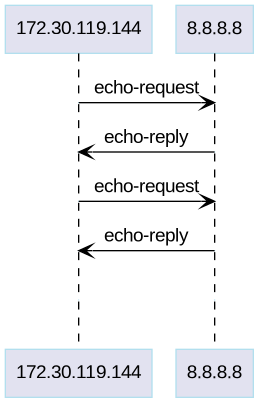
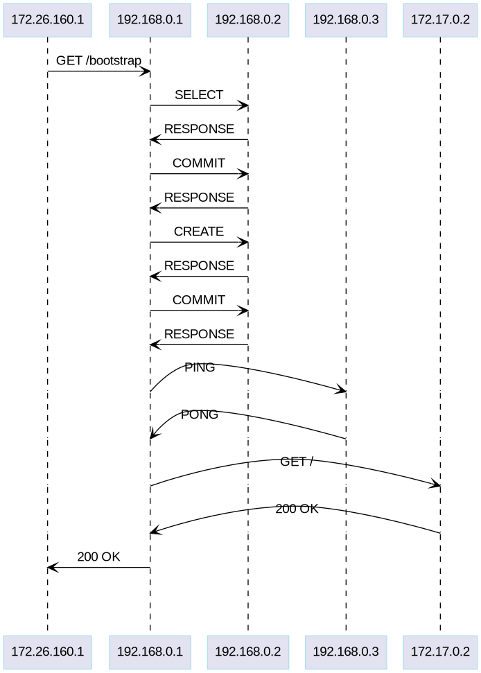

# Pcap to Sequence Diagram

This code is associated with the LinkedIN article I wrote to generate Sequence Diagrams from Pcap files, It's a working PoC not intended to be a dependency.

## Examples

``` python3 generate_chart.py example_pcap/icmp.pcap ```



``` python3 generate_chart.py example_pcap/get_bootstrap.pcap ```



## Todo

[ ] Implement Dissectors differently

[ ] Try to auto detect dissector to use, guess protocol ...

[ ] Seperate the Chart code from the Pcap code

[ ] Support Multiple input types: CSV, YAML, JSON, TSV
